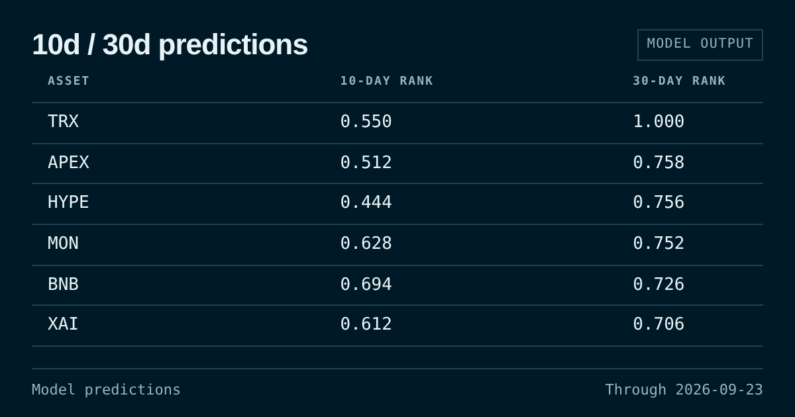
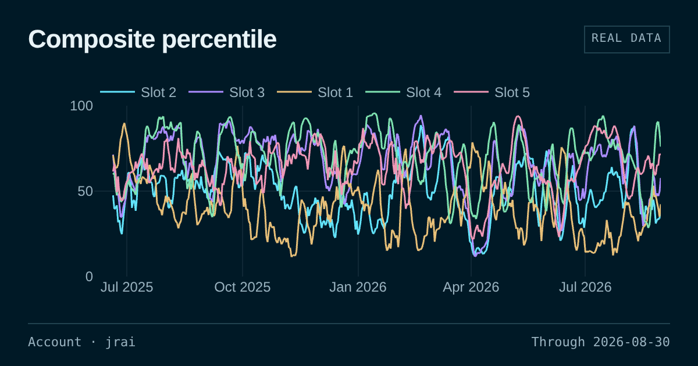
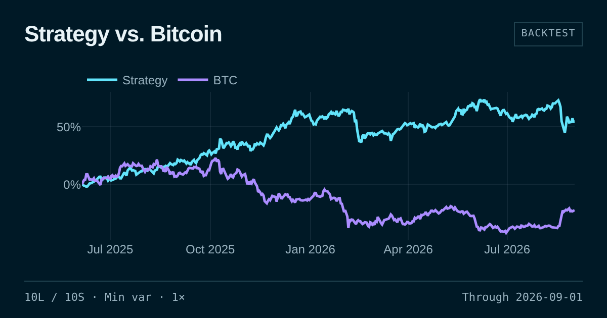
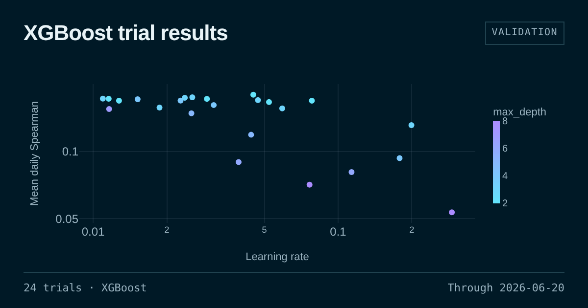
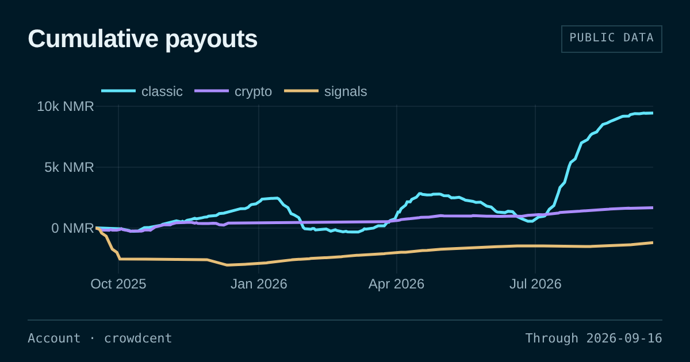
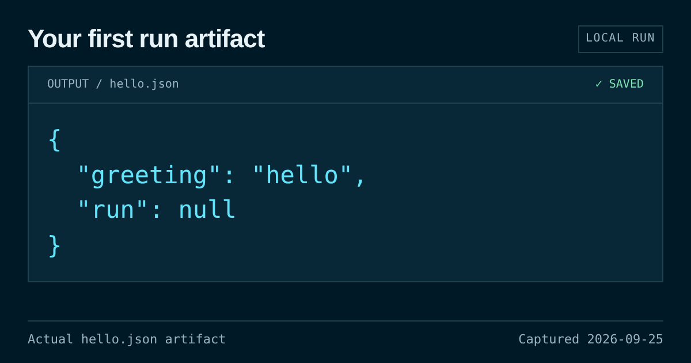

# CrowdCent Cookbook

Open-source [marimo](https://marimo.io) notebooks for the
[CrowdCent Challenge](https://crowdcent.com) and CrowdCent Cloud.

Each recipe is a folder under `recipes/`. The notebook carries the folder's
name; helper modules travel beside it. Preview images live in marimo's
standard `__marimo__/assets/` directory and are not runtime helpers. A folder
opens on CrowdCent Cloud as one project, and the same files run on a laptop:

```bash
uvx marimo edit --sandbox recipes/numerai_dashboard/numerai_dashboard.py
```

Every notebook declares its dependencies in a
[PEP 723](https://peps.python.org/pep-0723/) block, so `--sandbox` builds the
environment the notebook asks for and nothing else.

## Recipes

Every card is a real result from the notebook behind it, rendered from the
committed snapshot with its source and date on the image.

<table>
  <tr>
    <td width="33%" valign="top">
      <a href="recipes/hyperliquid_ranking"></a><br>
      <strong><a href="recipes/hyperliquid_ranking">Hyperliquid ranking</a></strong><br>
      <sub>Trains a model on CrowdCent's training data and submits 10d and 30d predictions.</sub>
    </td>
    <td width="33%" valign="top">
      <a href="recipes/track_your_performance"></a><br>
      <strong><a href="recipes/track_your_performance">Track your performance</a></strong><br>
      <sub>Charts every scored submission you have made, by slot.</sub>
    </td>
    <td width="33%" valign="top">
      <a href="recipes/simulate_the_meta_model"></a><br>
      <strong><a href="recipes/simulate_the_meta_model">Simulate the meta-model</a></strong><br>
      <sub>Backtests the meta-model as a long/short book from a few sliders.</sub>
    </td>
  </tr>
  <tr>
    <td width="33%" valign="top">
      <a href="recipes/optuna_tuning"></a><br>
      <strong><a href="recipes/optuna_tuning">Optuna tuning</a></strong><br>
      <sub>Tunes XGBoost with Optuna, from a form in the browser or with defaults on Cloud.</sub>
    </td>
    <td width="33%" valign="top">
      <a href="recipes/numerai_dashboard"></a><br>
      <strong><a href="recipes/numerai_dashboard">Numerai dashboard</a></strong><br>
      <sub>Reads payouts, stake, and per-model scores for any Numerai account.</sub>
    </td>
    <td width="33%" valign="top">
      <a href="recipes/hello_cloud"></a><br>
      <strong><a href="recipes/hello_cloud">Hello Cloud</a></strong><br>
      <sub>Tells a Cloud run from a tab and leaves a file behind for the run report.</sub>
    </td>
  </tr>
</table>

Cloud runs execute automatically with defaults saved in the notebooks.
The simulator, Optuna search, and Numerai dashboard also accept run
parameters; the submission recipe automatically submits to slot 1.
Interactive forms and submission buttons still wait for your input.

Recipes that call CrowdCent read `CROWDCENT_API_KEY` from the environment. On
Cloud that is the project's Challenge access switch; elsewhere,
[create a key](https://crowdcent.com/profile/settings/) and export it.

## Preview images

Recipe cards use actual notebook results, with a source/account and date on
each image. The committed snapshots let anyone check or render thumbnails
without API keys:

```bash
uv sync --locked --group thumbnails
uv run python scripts/thumbnails.py --check --preview
```

This opens a standalone local gallery at `out/thumbnails/index.html`.
Refreshing live results is a separate `--capture` command that needs the
recipe's normal access. See [the thumbnail guide](./CONTRIBUTING.md#recipe-card-previews)
for capture, rendering, new recipes, and the required CI check.

## Contributing

Copy the closest recipe folder, edit it in marimo, and open a pull request.
The checklist is in [CONTRIBUTING.md](./CONTRIBUTING.md).

## License

[MIT](./LICENSE)
